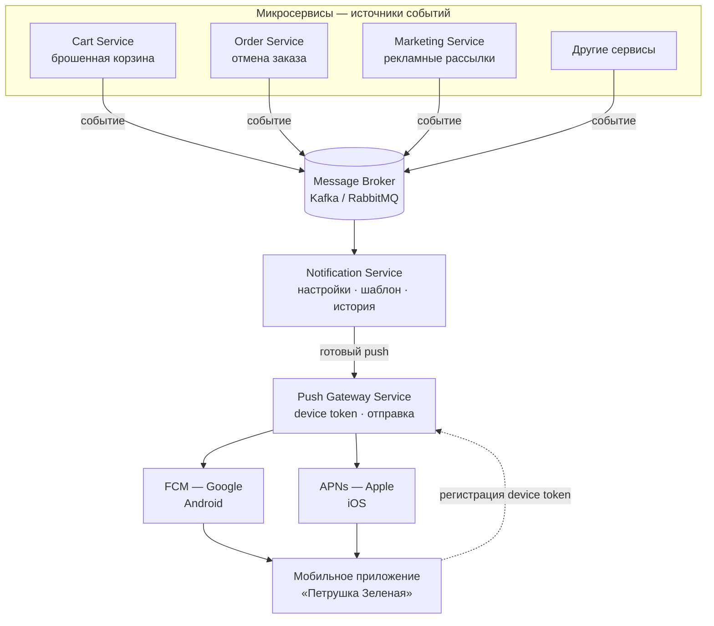

Тестовое задание: Системный аналитик (junior)

Проект: интернет-магазин «Петрушка Зеленая»  


Задание 1. Анализ требований - функционал «Корзина»

1.1. Найденные противоречия и недочёты

1. П. 2 и п. 9 - прямое противоречие

П. 2: количество товара нельзя уменьшить ниже 1, удаление - только отдельной кнопкой.  
П. 9: при уменьшении количества до 0 товар удаляется.  
Нельзя одновременно запретить 0 и предусмотреть удаление через 0.

2. П. 7 и п. 13 - прямое противоречие

П. 7: цена фиксируется при добавлении и не меняется.  
П. 13: при изменении цены в каталоге система автоматически обновляет её во всех корзинах.  
Это взаимоисключающие правила.

3. П. 1, п. 3, п. 4 - конфликт лимитов без правил приоритета

Можно добавить до 10 шт. одного товара, но не более 5 разных позиций и не более 20 шт. суммарно. Не описано, что происходит, если пользователь добавляет товар, который формально укладывается в один лимит, но нарушает другой.  
Пример: в корзине уже 4 позиции по 4 шт. = 16 шт., пользователь добавляет новый товар - какой лимит срабатывает первым?

4. П. 6 - недостаточная детализация сообщения об ошибке

Одно сообщение «Лимит корзины превышен» для всех типов нарушений (лимит на позицию, на число SKU, на общее количество). Пользователь не понимает, что именно исправить.

5. П. 10 и п. 11 - неполное описание рекламы

П. 10 говорит, что реклама *может* быть. П. 11 - что она *должна* показываться в будние дни утром и вечером. Не определено: что в выходные, днём, ночью; что значит «утром» и «вечером» (временные интервалы, часовой пояс).

6. П. 11 - отсутствует п. 12

Разрыв в нумерации - вероятная опечатка или пропущенное требование. Для разработки это риск неполного ТЗ.

7. П. 7 - неполное определение «цены»

Не уточнено: базовая цена, цена со скидкой, цена с учётом акции, НДС, валюта. При «фиксации» непонятно, какое именно значение сохраняется.

8. П. 2 - двусмысленная формулировка

Фраза «не менее, чем до 1-го» неоднозначна. Скорее всего имелось в виду «не меньше 1», но в ТЗ это не сформулировано чётко.

9. П. 8 - неполный состав экрана корзины

Не описаны: итоговая сумма заказа, кнопка оформления, состояние пустой корзины, поведение при недоступном товаре.

10. Общее - не описаны граничные сценарии

Повторное добавление того же товара (увеличение количества или новая строка?), гостевая корзина vs авторизованный пользователь, срок жизни корзины, поведение при отсутствии товара на складе, объединение корзин при входе в аккаунт.

11. П. 13 (если принять его) - конфликт с бизнес-логикой оформления

Автообновление цены в корзине может изменить итог без явного согласия пользователя перед оплатой - не описаны правила уведомления и пересчёта.


1.2. Исправленная версия фрагмента ТЗ

Функционал корзины

Общие правила

1. Пользователь (гость или авторизованный) может добавлять в корзину товары из каталога.
2. При повторном добавлении уже находящегося в корзине товара увеличивается количество существующей позиции (новая строка не создаётся).
3. Для одной позиции (одного товара) допустимое количество: от 1 до 10 штук включительно.
4. В корзине может находиться не более 5 различных товаров (позиций).
5. Суммарное количество всех товаров в корзине не может превышать 20 штук.
6. При попытке действия, нарушающего любой из лимитов (п. 3–5), операция не выполняется, количество в корзине не меняется. Система показывает сообщение:
   - «Максимум 10 штук одного товара» - при превышении лимита на позицию;
   - «В корзине не более 5 разных товаров» - при превышении лимита позиций;
   - «В корзине не более 20 товаров суммарно» - при превышении общего лимита.
7. Если одновременно нарушается несколько лимитов, показывается сообщение о наиболее ограничивающем лимите (сначала общий лимит 20 шт., затем лимит 5 позиций, затем лимит 10 шт. на позицию).

Изменение и удаление

8. Пользователь может изменять количество каждой позиции в диапазоне от 1 до 10 с учётом лимитов п. 4–5.
9. Удаление позиции из корзины выполняется только кнопкой «Удалить» (уменьшение количества до 0 через счётчик «−» не предусмотрено).
10. При удалении последней позиции отображается состояние «Корзина пуста».

Цена

11. При добавлении товара в корзину фиксируется актуальная цена продажи из каталога на момент добавления (с учётом действующих персональных скидок пользователя, если они есть).
12. Зафиксированная цена не пересчитывается автоматически при изменении цены в каталоге.
13. Если товар в корзине стал недоступен (снят с продажи, нет на складе), позиция помечается как недоступная; оформление заказа с этой позицией невозможно до её удаления пользователем.

Отображение

14. На странице корзины отображаются: список позиций, наименование, количество, цена за единицу (зафиксированная), стоимость позиции (цена × количество), итоговая сумма корзины, кнопка «Оформить заказ».
15. Корзина гостя хранится 30 дней (cookie/local storage); корзина авторизованного пользователя - в профиле до оформления заказа или 90 дней бездействия.

Реклама в корзине

16. В корзине может отображаться блок рекламных карточек других товаров.
17. Содержимое рекламы подбирается сервисом рекомендаций; клик ведёт на карточку товара в каталоге.


1.3. Уточняющие вопросы к продукт-менеджеру / заказчику

По лимитам и UX

1. Какой лимит важнее с точки зрения бизнеса - 5 позиций или 20 штук суммарно? Нужны ли разные тексты ошибок?
2. Можно ли добавить 6-й товар, если при этом общее количество останется ≤ 20?

По цене

3. Должна ли фиксироваться цена со скидкой или только базовая?
4. Нужно ли уведомлять пользователя, если цена в каталоге изменилась, но в корзине осталась старая?
5. Что делать при оформлении, если зафиксированная цена ниже актуальной (продавать по старой или по новой)?

По удалению

6. Подтверждаем, что удаление только через кнопку «Удалить», без уменьшения до 0?

По рекламе

7. Реклама одинакова для всех пользователей или персонализирована?

По техническим сценариям

8. Нужна ли синхронизация корзины гостя и авторизованного пользователя при входе в аккаунт?
9. Как поступать с товаром, который закончился на складе, но остался в корзине?
10. Есть ли минимальная сумма заказа?


Задание 2. Проектирование API - экран «Выберите магазин»


2.1. Пример REST API запроса

Запрос выполняется при переходе пользователя на экран (и при pull-to-refresh). Адрес доставки передаётся в query, чтобы бэкенд рассчитал ближайшие слоты для каждого магазина.

```http
GET /api/v1/partner-stores?address_id=addr-48291&lat=55.751244&lon=37.618423 HTTP/1.1
Host: api.petrushka-zelenaya.ru
Accept: application/json
Authorization: Bearer <access_token>
X-App-Version: 2.4.0
X-Platform: ios
```

Параметры запроса (query):

- `address_id` (string) - ID сохранённого адреса пользователя. Обязателен*, если не переданы координаты.
- `lat` (float) - широта точки доставки. Обязателен*, если не передан `address_id`.
- `lon` (float) - долгота точки доставки. Обязателен*, если не передан `address_id`.
- `page` (integer) - номер страницы, по умолчанию 1. Необязательный.
- `limit` (integer) - количество магазинов на странице, по умолчанию 20. Необязательный.

\* Достаточно передать `address_id` или пару `lat` + `lon`.

Ожидаемые коды ответа:

- `200 OK` - список успешно получен
- `400 Bad Request` - не передан адрес / координаты
- `401 Unauthorized` - невалидный или отсутствующий токен
- `500 Internal Server Error` - ошибка сервера

2.2. Пример ответа (JSON)

```json
{
  "screen": {
    "title": "Выберите магазин"
  },
  "delivery_address": {
    "id": "addr-48291",
    "short_label": "ул. Тверская, 12"
  },
  "partner_stores": [
    {
      "id": "metro",
      "name": "METRO",
      "logo_url": "https://cdn.petrushka-zelenaya.ru/partners/metro/logo.png",
      "delivery": {
        "type": "scheduled",
        "prefix": "Ближайшая доставка сегодня",
        "time_slot": "21:00-23:00",
        "highlight": null,
        "display_text": "Ближайшая доставка сегодня 21:00-23:00"
      },
      "external_url": "https://online.metro-cc.ru/?utm_source=petrushka_app",
      "sort_order": 1
    },
    {
      "id": "auchan",
      "name": "Ашан",
      "logo_url": "https://cdn.petrushka-zelenaya.ru/partners/auchan/logo.png",
      "delivery": {
        "type": "scheduled",
        "prefix": "Ближайшая доставка сегодня",
        "time_slot": "18:00-20:00",
        "highlight": null,
        "display_text": "Ближайшая доставка сегодня 18:00-20:00"
      },
      "external_url": "https://www.auchan.ru/?utm_source=petrushka_app",
      "sort_order": 2
    },
    {
      "id": "vkusvill",
      "name": "ВкусВилл",
      "logo_url": "https://cdn.petrushka-zelenaya.ru/partners/vkusvill/logo.png",
      "delivery": {
        "type": "express",
        "prefix": "Быстрая доставка",
        "time_slot": null,
        "highlight": "от 20 до 60 минут",
        "display_text": "Быстрая доставка от 20 до 60 минут"
      },
      "external_url": "https://vkusvill.ru/?utm_source=petrushka_app",
      "sort_order": 3
    },
    {
      "id": "victoria",
      "name": "ВИКТОРИЯ",
      "logo_url": "https://cdn.petrushka-zelenaya.ru/partners/victoria/logo.png",
      "delivery": {
        "type": "scheduled",
        "prefix": "Ближайшая доставка сегодня",
        "time_slot": "17:00-19:00",
        "highlight": null,
        "display_text": "Ближайшая доставка сегодня 17:00-19:00"
      },
      "external_url": "https://victoria-group.ru/?utm_source=petrushka_app",
      "sort_order": 4
    }
  ],
  "pagination": {
    "page": 1,
    "limit": 20,
    "total_items": 4,
    "total_pages": 1
  }
}
```

Соответствие полей макету:

- Заголовок «Выберите магазин» - `screen.title`
- Строка адреса под заголовком - `delivery_address.short_label`
- Название магазина (METRO, Ашан…) - `name`
- Текст о доставке - `delivery.display_text`
- Синий акцент на «от 20 до 60 минут» - `delivery.highlight` (клиент красит это значение, если `type = express`)
- Логотип справа - `logo_url`

Поведение на клиенте:

- При тапе на карточку магазина приложение открывает `external_url` во встроенном WebView или системном браузере (требование ТЗ).
- Для `delivery.type = scheduled` отображается `prefix` + `time_slot`.
- Для `delivery.type = express` отображается `prefix` + `highlight` (выделено акцентным цветом).


Задание 3. Архитектура - отправка PUSH-уведомлений

Задача: построить верхнеуровневую схему отправки push в мобильное приложение «Петрушка Зеленая».  
Бэкенд - микросервисы. Push бывают разные (брошенная корзина, отмена заказа, реклама и др.) - архитектура должна позволять добавлять новые типы без переделки всей системы.

3.1. Верхнеуровневая блок-схема



**Как читать схему:**

1. Микросервис (Cart / Order / Marketing) фиксирует событие и публикует его в очередь.
2. Notification Service проверяет настройки пользователя и формирует текст push.
3. Push Gateway Service находит device token и отправляет уведомление через FCM или APNs.
4. Пользователь видит push в мобильном приложении.
5. Пунктирная стрелка: при установке приложение регистрирует device token в Push Gateway.
